<<<<<<< HEAD
# JOJO Music Client 🎵
=======
# JOJO MUSIC Client 🎵
>>>>>>> e03be03 (feat: refresh project identity and README)

## 项目简介

<<<<<<< HEAD
**JOJO Music Client** 是一款基于 **Vue 3**、**Vite 5**、**Pinia**、**Tailwind
CSS** 和 **Element Plus**
开发的现代化 Web 音乐播放器。本项目旨在提供美观、流畅且功能丰富的音乐播放体验，后端服务由
**Vibe Music Server** 提供支持。
=======
**JOJO MUSIC Client** 是 JOJO MUSIC 的前端音乐播放器端，提供在线音乐浏览、搜索、播放和用户个性化体验。
>>>>>>> e03be03 (feat: refresh project identity and README)

本项目基于 **Vue 3 + Vite + TypeScript + Pinia + Tailwind CSS + Element Plus** 构建，聚焦于音乐播放、推荐、歌单和用户互动体验。

## 主要功能

### 游客用户

- 浏览音乐、歌手、歌单
- 搜索音乐并进行基础播放
- 夜间模式切换

### 登录用户

- 注册、登录、退出
- 编辑个人资料与头像
- 收藏歌曲和歌单
- 查看推荐内容
- 留言和评论互动
- 下载与播放控制

## 技术栈

- Vue 3
- Vite
- TypeScript
- Pinia
- Element Plus
- Tailwind CSS

## 系统要求

- Node.js >= 18
- pnpm >= 7

## 仓库地址

- GitHub: https://github.com/timi669/jojo-music-client
- Admin: https://github.com/timi669/jojo-music-admin
- Server: https://github.com/timi669/jojo-music-server

## 安装与运行

1. 克隆项目

   ```bash
   git clone https://github.com/timi669/jojo-music-client.git
   cd jojo-music-client
   ```

2. 安装依赖

   ```bash
   pnpm install
   ```

3. 配置环境变量

   - 复制 `.env.development` 文件并修改为本地实际配置
   - 配置 `VITE_APP_BASE_API` 为 JOJO MUSIC Server 的地址

   ```env
   VITE_APP_BASE_API=http://localhost:8080
   ```

4. 启动开发服务器

   ```bash
   pnpm dev
   ```

5. 构建生产版本

   ```bash
   pnpm build
   ```

6. 预览构建结果

   ```bash
   pnpm preview
   ```

## 项目脚本

- `pnpm dev`：启动开发服务器
- `pnpm build`：生产环境构建
- `pnpm preview`：本地预览
- `pnpm lint`：检查代码规范
- `pnpm format`：格式化代码
- `pnpm type-check`：TypeScript 类型检查

## 项目截图

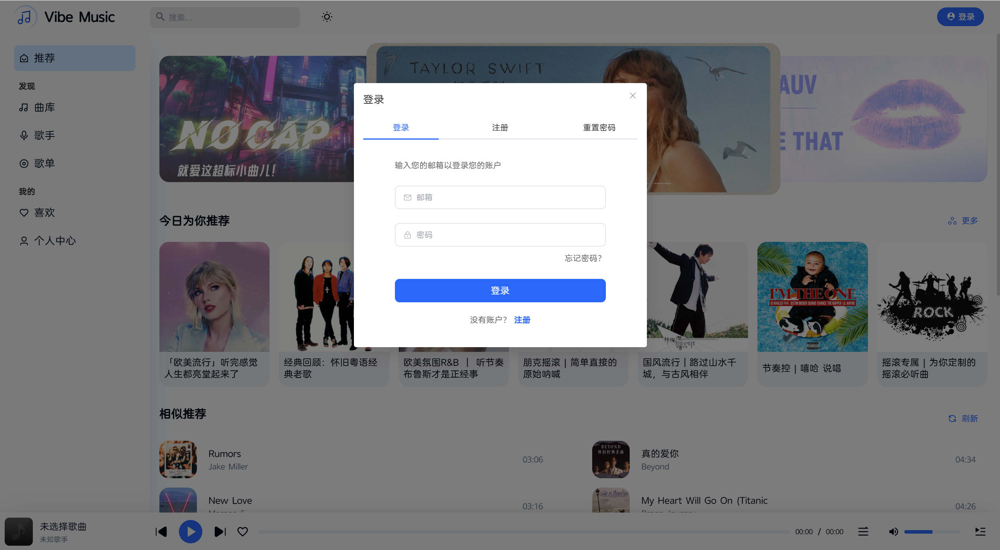
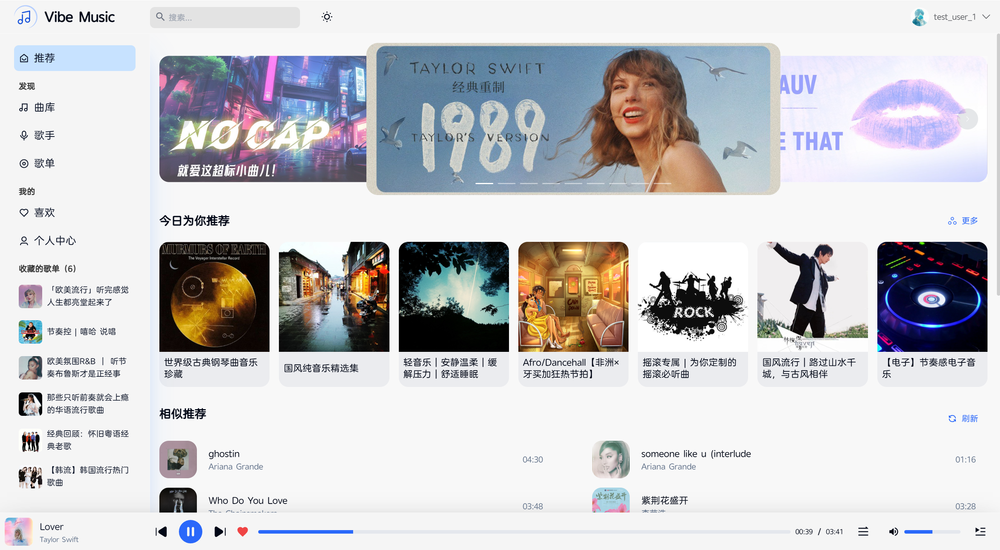
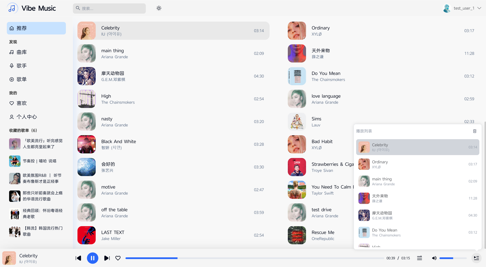
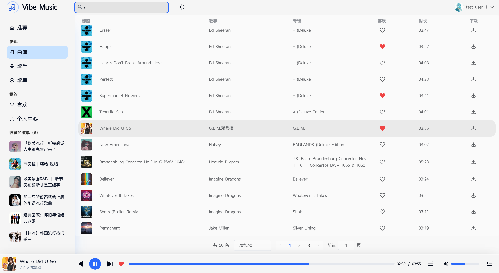
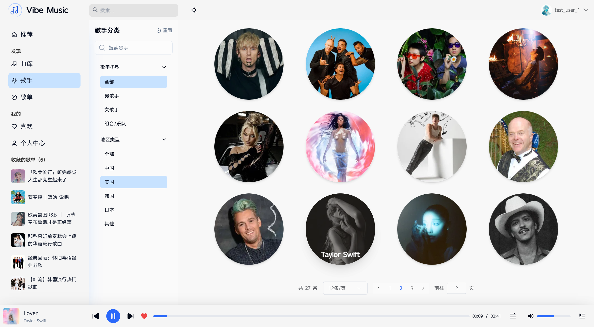
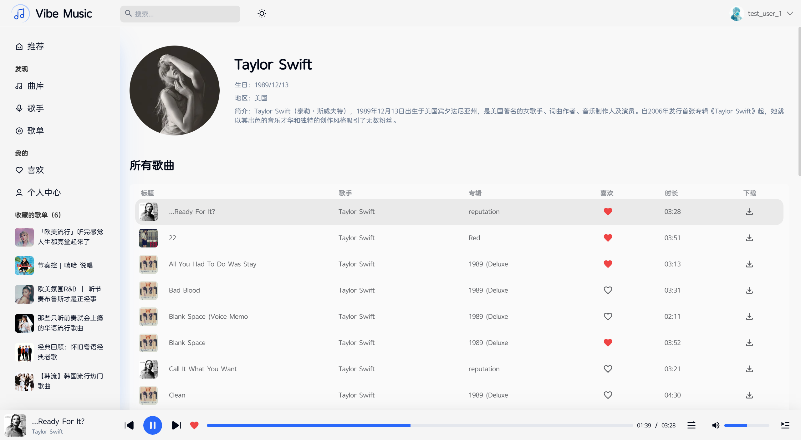
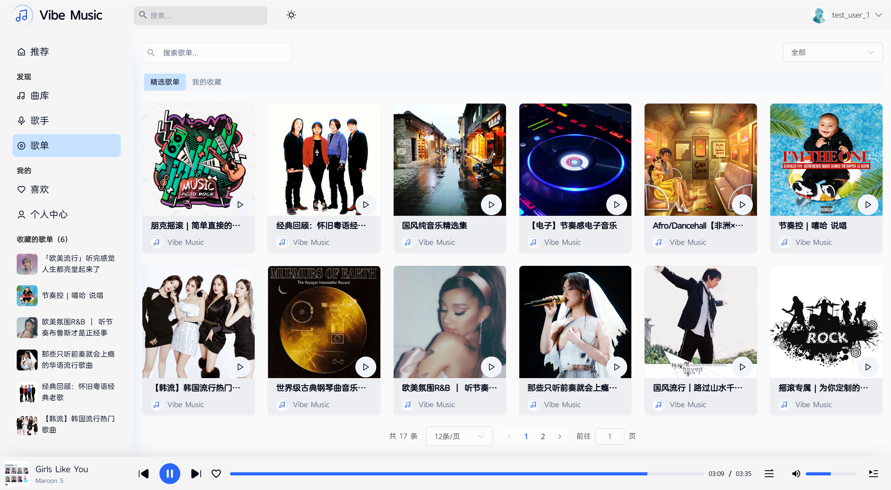
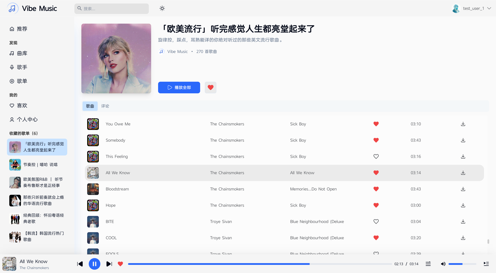
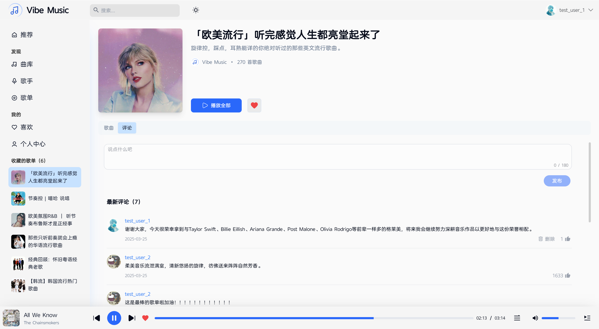
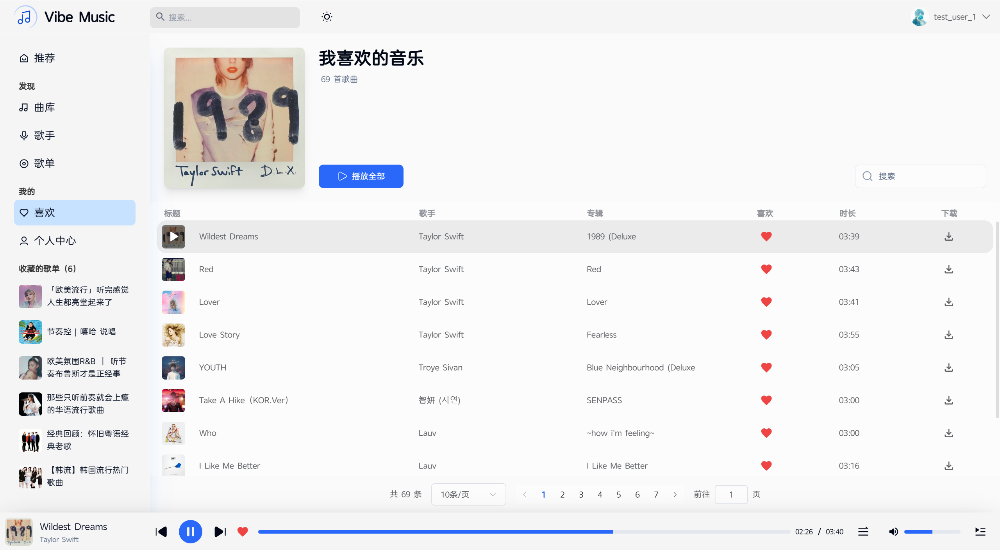
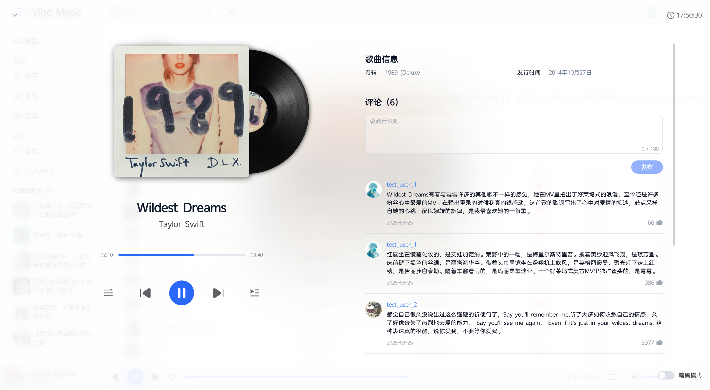
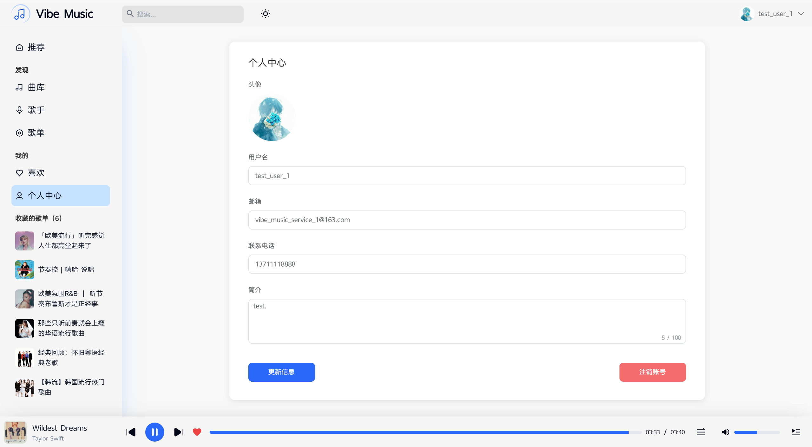

## 后端依赖

本项目依赖 JOJO MUSIC Server 提供 API 与数据支持。

- 后端仓库：https://github.com/timi669/jojo-music-server

## 版权与免责声明

本项目仅供学习、研究和个人开发实践使用。

- 请勿用于侵权、违法或商业用途
- 你必须确保内容来源、资源授权和部署环境合法合规
- 因使用本项目产生的后果由使用者自行承担

## 许可证

本项目遵循 MIT 许可证，详情请查看 [LICENSE](LICENSE)。

## 贡献

欢迎提交 Issue、Pull Request 和改进建议。
